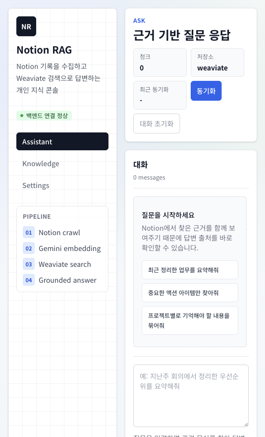

# notion-rag

Notion에 기록한 문서를 수집하고, Gemini 임베딩과 Weaviate 벡터 검색을 거쳐 답변하는 개인용 RAG 프로젝트입니다.

## 개요

이 프로젝트는 "내 Notion을 기억하는 AI 비서"를 목표로 합니다.

1. 지정한 Notion 루트 페이지부터 하위 페이지를 재귀 수집합니다.
2. 페이지 내용을 청크 단위로 나눕니다.
3. Gemini Embedding API로 각 청크의 벡터를 생성합니다.
4. 벡터와 원문 청크를 Weaviate에 저장합니다.
5. 질문이 들어오면 질문도 임베딩한 뒤 유사 청크를 검색합니다.
6. 검색된 근거만 사용해 Gemini Generation API로 답변을 생성합니다.

## 화면



## 기술 스택

- Backend: Go, Gin, Swagger
- Frontend: React, TypeScript, Vite, Tailwind CSS
- Vector DB: Weaviate
- LLM: Gemini Embedding API, Gemini Generation API
- Source: Notion API
- Runtime: Docker, Docker Compose
- Local fallback: JSON file store

## 폴더 구조

```text
.
├── backend
│   ├── cmd/server
│   ├── docs
│   └── internal
│       ├── app
│       ├── chunk
│       ├── clients
│       │   ├── gemini
│       │   └── notion
│       ├── config
│       ├── domain
│       │   └── knowledge
│       ├── httpapi
│       │   ├── middleware
│       │   ├── router
│       │   └── v1
│       │       ├── handlers
│       │       ├── requests
│       │       └── responses
│       ├── repositories
│       │   ├── documents
│       │   └── weaviate
│       ├── services
│       │   ├── ingest
│       │   └── rag
│       └── settings
├── frontend
│   └── src
│       ├── components
│       ├── features
│       │   ├── assistant
│       │   ├── knowledge
│       │   └── settings
│       ├── hooks
│       └── lib
├── docker-compose.yml
├── Makefile
└── README.md
```

## 주요 기능

- Notion 페이지 재귀 수집
- 텍스트 청킹
- Gemini 기반 임베딩 생성
- Weaviate 벡터 저장 및 유사도 검색
- 파일 기반 벡터 저장소 fallback
- 근거 기반 답변 생성
- 검색 근거, 신뢰도, 후속 질문 제공
- Notion 원문 링크 열기
- Knowledge 탭에서 인덱스 상태와 최근 청크 확인
- 런타임 설정 조회/수정 API
- Swagger UI 제공

## 빠른 시작

`.env` 파일을 생성합니다.

```bash
make env
```

필수 설정:

- `NOTION_TOKEN`
- `NOTION_ROOT_PAGE_IDS`
- `GEMINI_API_KEY`
- `VITE_API_BASE_URL`

예시:

```env
NOTION_TOKEN=secret_xxx
NOTION_ROOT_PAGE_IDS=2d105bf2-ff64-80c6-9fd9-eb2f39a07bc8
GEMINI_API_KEY=your-gemini-api-key
VITE_API_BASE_URL=http://localhost:8080
```

`NOTION_ROOT_PAGE_IDS`에는 Notion 페이지 UUID를 넣습니다. 여러 페이지를 시작점으로 사용할 경우 쉼표로 구분합니다.

주의:

- 해당 Notion 페이지는 Notion integration에 공유되어 있어야 합니다.
- 공유되지 않은 페이지는 API가 읽을 수 없습니다.

전체 실행:

```bash
make up
```

중지:

```bash
make down
```

재시작:

```bash
make restart
```

## 접속 주소

- Frontend: `http://localhost:3000`
- Backend API: `http://localhost:8080`
- Swagger UI: `http://localhost:8080/swagger/index.html`
- OpenAPI JSON: `http://localhost:8080/swagger/doc.json`
- Weaviate HTTP: `http://localhost:8081`
- Weaviate gRPC: `localhost:50051`

Weaviate Docker 이미지 자체에는 로컬 웹 GUI가 포함되어 있지 않습니다. 대신 프론트의 `Knowledge` 탭에서 현재 벡터 저장소, 컬렉션, 문서 수, 최근 인덱싱 청크를 확인합니다.

## 환경 변수

기본값은 Docker Compose 기준입니다.

```env
BACKEND_PORT=8080
FRONTEND_PORT=3000
VITE_API_BASE_URL=http://localhost:8080

HTTP_ADDR=:8080
DATA_DIR=/app/data

VECTOR_STORE=weaviate
WEAVIATE_URL=http://localhost:8081
WEAVIATE_INTERNAL_URL=http://weaviate:8080
WEAVIATE_CLASS_NAME=NotionChunk
WEAVIATE_HTTP_PORT=8081
WEAVIATE_GRPC_PORT=50051

NOTION_VERSION=2026-03-11
GEMINI_EMBEDDING_MODEL=gemini-embedding-001
GEMINI_GENERATION_MODEL=gemini-2.5-flash

CHUNK_SIZE=1000
CHUNK_OVERLAP=150
TOP_K=6
SIMILARITY_CUTOFF=0.65
WORKER_COUNT=4
REQUEST_TIMEOUT=60s
SHUTDOWN_TIMEOUT=10s
```

저장소 전환:

```env
VECTOR_STORE=weaviate
```

또는 로컬 JSON 파일 저장소를 사용하려면:

```env
VECTOR_STORE=file
```

Docker Compose에서 백엔드는 `WEAVIATE_INTERNAL_URL` 값을 사용해 `http://weaviate:8080`으로 접속합니다. 로컬에서 `make backend-run`으로 백엔드만 실행할 때는 `WEAVIATE_URL=http://localhost:8081`을 사용합니다.

## Makefile 커맨드

```bash
make help
make env
make up
make down
make build
make logs
make ps
make restart
make sync
make query q="지난주에 내가 정리한 업무 내용을 요약해줘"
make test
make fmt
make swagger
make weaviate-ready
make weaviate-meta
make frontend-install
make frontend-ensure
make frontend-build
make frontend-dev
make backend-run
make backend-run BACKEND_PORT=8081
make compose-config
make clean
make clean-deps
make clean-data
```

## API 예시

헬스 체크:

```bash
curl http://localhost:8080/healthz
```

통계 조회:

```bash
curl http://localhost:8080/api/v1/stats
```

인덱싱된 청크 조회:

```bash
curl "http://localhost:8080/api/v1/documents?limit=25"
```

Notion 동기화:

```bash
curl -X POST http://localhost:8080/api/v1/sync
```

질문:

```bash
curl -X POST http://localhost:8080/api/v1/query \
  -H 'Content-Type: application/json' \
  -d '{"question":"지난주에 내가 정리한 업무 내용을 요약해줘"}'
```

설정 조회:

```bash
curl http://localhost:8080/api/v1/settings
```

설정 수정:

```bash
curl -X PUT http://localhost:8080/api/v1/settings \
  -H 'Content-Type: application/json' \
  -d '{
    "notion_token": "secret_xxx",
    "notion_version": "2026-03-11",
    "notion_root_page_ids": "2d105bf2-ff64-80c6-9fd9-eb2f39a07bc8",
    "gemini_api_key": "your-api-key",
    "embedding_model": "gemini-embedding-001",
    "generation_model": "gemini-2.5-flash"
  }'
```

`notion_root_page_ids`는 문자열 CSV 형식으로 받습니다.

```json
"notion_root_page_ids": "uuid-1,uuid-2"
```

## 로컬 개발

백엔드만 실행:

```bash
make backend-run
```

로컬 실행 시 백엔드는 `.env`를 읽되, Docker 전용 경로인 `/app/data` 대신 프로젝트 루트의 `.local-data`를 사용합니다. 8080 포트가 이미 사용 중이면 아래처럼 포트를 바꿀 수 있습니다.

```bash
make backend-run BACKEND_PORT=8081
```

프론트 개발 서버 실행:

```bash
make frontend-dev
```

`make frontend-dev`와 `make frontend-build`는 `node_modules/.bin/vite`가 없으면 `yarn install --frozen-lockfile`을 먼저 실행합니다.

Swagger 문서 재생성:

```bash
make swagger
```

Weaviate 상태 확인:

```bash
make weaviate-ready
make weaviate-meta
```

## 구현 메모

- `domain/knowledge.Store` 인터페이스로 저장소를 추상화했습니다.
- `repositories/documents`는 JSON 파일 기반 fallback 저장소입니다.
- `repositories/weaviate`는 Weaviate REST/GraphQL API를 직접 호출합니다.
- Weaviate 컬렉션명은 기본 `NotionChunk`입니다.
- 임베딩은 애플리케이션에서 생성하고, Weaviate에는 `vectorizer=none`으로 저장합니다.
- 동기화는 현재 전체 교체 방식입니다. Notion 변경 감지 기반 증분 동기화는 다음 고도화 후보입니다.

## 참고

- 개발용 Docker Compose에서는 Weaviate anonymous access를 사용합니다.
- 운영 환경에서는 Weaviate API key/RBAC 구성을 추가해야 합니다.
- `.env`에는 Notion/Gemini 키가 들어가므로 커밋하지 않습니다.
